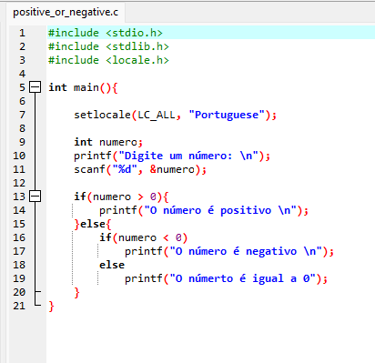
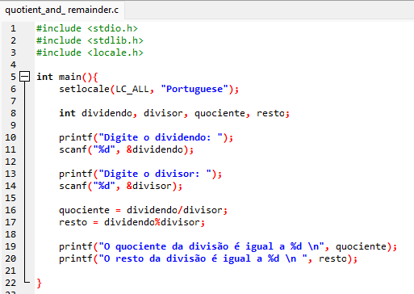

<h1>Atividade da disciplina de Algoritmos e Lógica de Programação 2</h1>

   
Esse é um pequeno algoritmo em C, que solicita ao usuário 
   um número qualquer e informa se o número é positivo ou negativo.
   

   

<h1>MAPA - Material de Aprendizagem Prática</h1>

   
Esse é um  algoritmo em linguagem C para encontrar o quociente e o resto de uma divisão, com base nos valores do dividendo e divisor inseridos pelo usuário.   
   

    
