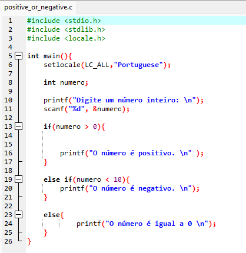

<h1>Atividade da disciplina de Algoritmos e Lógica de Programação 2</h1>

Esse é um pequeno programa feito em C, que pede para o usuário um número qualquer e informa se o número é positivo ou negativo.
  

